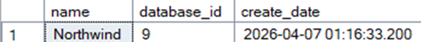

# 2.-Veritaban-Yedekleme-ve-Felaketten-Kurtarma-Plan-

Ağ Tabanlı Paralel Dağıtım Sistemleri dersi için yapılan 2. Veritabanı Yedekleme ve Felaketten Kurtarma Planı projesi

# BLM 4522 PROJE RAPORU 

2. Veri tabanı Yedekleme ve Felaketten Kurtarma Planı
Zeynep Hacısalihoğlu
22290449


# 1.	GİRİŞ
Bu proje Microsoft SQL Server üzerinde Northwind örnek veri tabanı kullanılarak kapsamlı bir yedekleme ve felaketten kurtarma planının tasarlanması ve uygulanmasını konu almaktadır. Proje boyunca tam yedekleme, fark yedekleme ve transaction log yedekleme stratejileri ele alınmış; bu yedeklerin otomatize edilmesi ve felaket senaryolarında veri kurtarma süreçleri uygulamalı olarak gerçekleştirilmiştir.

## 1.1	Kullanılan Ortam

-  Veritabanı Sistemi: Microsoft SQL Server 2022 Developer Edition, Sürüm 16.0.1000.6 
-  Yönetim Aracı: SQL Server Management Studio (SSMS) 

## 1.2	Veri Tabanı Kurulumu

Proje kapsamında kullanılacak örnek veri tabanı olarak Northwind seçilmiştir. Northwind Microsoft tarafından yayımlanmış, bir ticaret şirketinin sipariş, ürün, müşteri ve çalışan verilerini barındıran klasik bir örnek veritabanıdır. Veritabanı SSMS üzerinden başarıyla yüklenmiş ve aşağıdaki sorgu ile doğrulanmıştır:

```sql
USE Northwind;
SELECT name, database_id, create_date 
FROM sys.databases 
WHERE name = 'Northwind';
```


